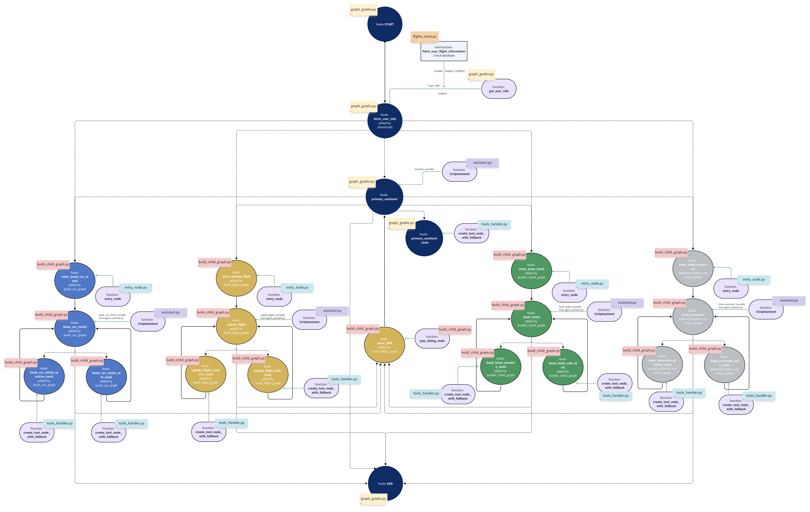

# Ctrip AI Assistant  

<p align="center">
  
</p>

Ctrip is a leading online travel agency in China, offering flight bookings, hotel reservations, and customized travel plans to millions of customers.  

This project leverages **LLMs** with **LangChain** to simulate a Ctrip AI assistant using dummy data. **Any LLM model can be used for this project**, and it can be modified in `./graph_chat/llm_tavily.py`.  

## Features  

The AI assistant interacts with users who have already booked a flight through Ctrip, enabling them to:  
- Check flight status  
- Modify flights  
- Book additional travel services, including hotels, car rentals, and excursions  

## Architecture  

The assistant consists of a **primary_assistant** responsible for engaging with the user and answering general inquiries, such as flight status, policy searches, and other web-based queries.  

For specific travel-related services, the **primary_assistant** delegates tasks to specialized assistants:  
- **update_flight** – Handles flight modifications  
- **book_hotel** – Manages hotel reservations  
- **book_car_rental** – Facilitates car rentals  
- **book_excursion** – Arranges excursions  

All **sensitive operations** involving database changes, such as flight modifications or new bookings, require **explicit user approval** before execution.  

## Workflow  

This project is built using **LangChain**. Below is a flowchart illustrating the assistant's operational mechanics:  

  

## Setup Instructions  

Before running the project, follow these steps to set up your environment:  

1. **Download the project repository** to your local machine.  
2. **Download the database files** from [this public link](https://drive.google.com/drive/folders/1o6Qu7xNAqr1PrrfzmZzcdBpoErJpr788?usp=sharing) and copy them to the project folder.  
3. **Set up your LLM model API key** by modifying `./graph_chat/llm_tavily.py`.  

## Running the Project  

To experience the assistant in a **prompt-based interface**, run:  
```bash
python ./graph_chat/graph3.py
```
To interact with the AI assistant in a web GUI powered by Gradio, run:
```bash
python ./graph_chat/graph_gradio.py
```